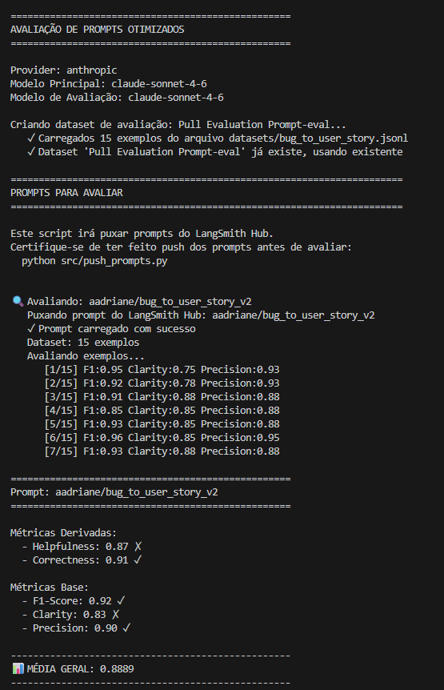
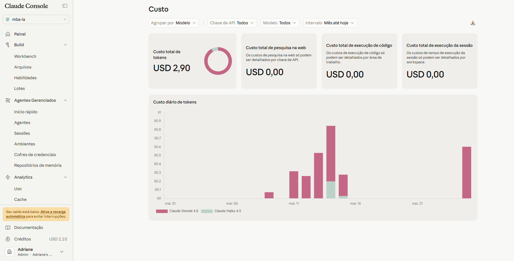
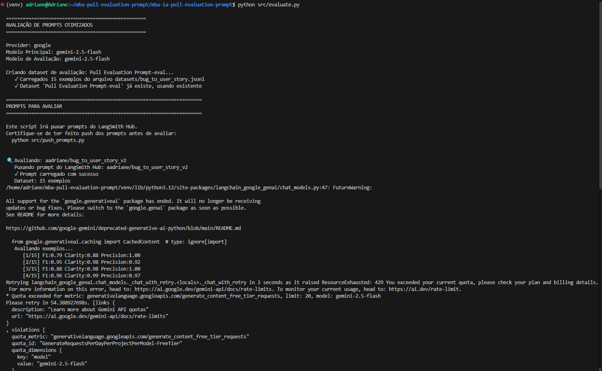
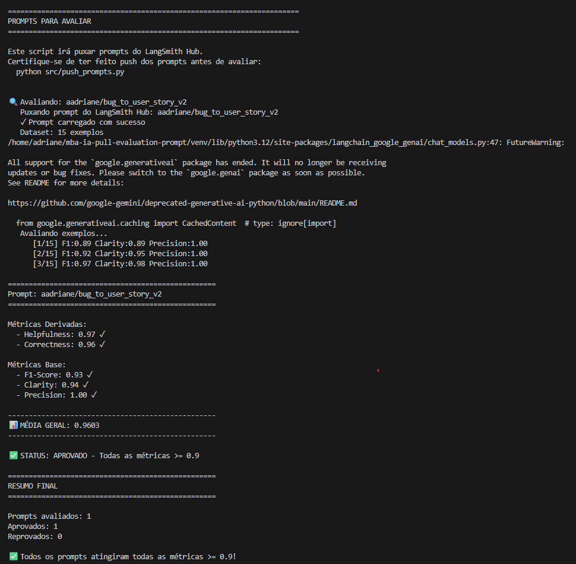
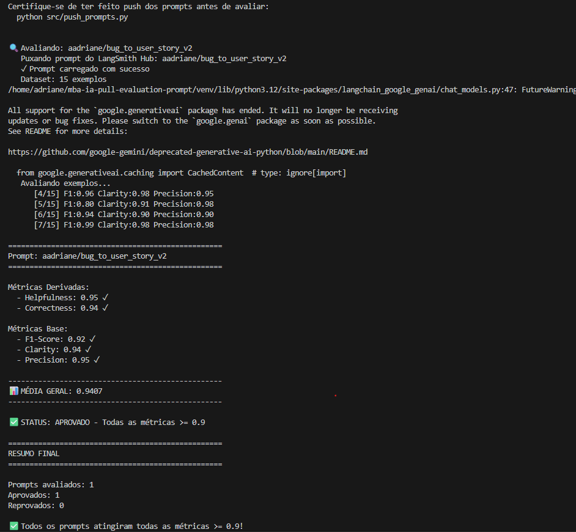
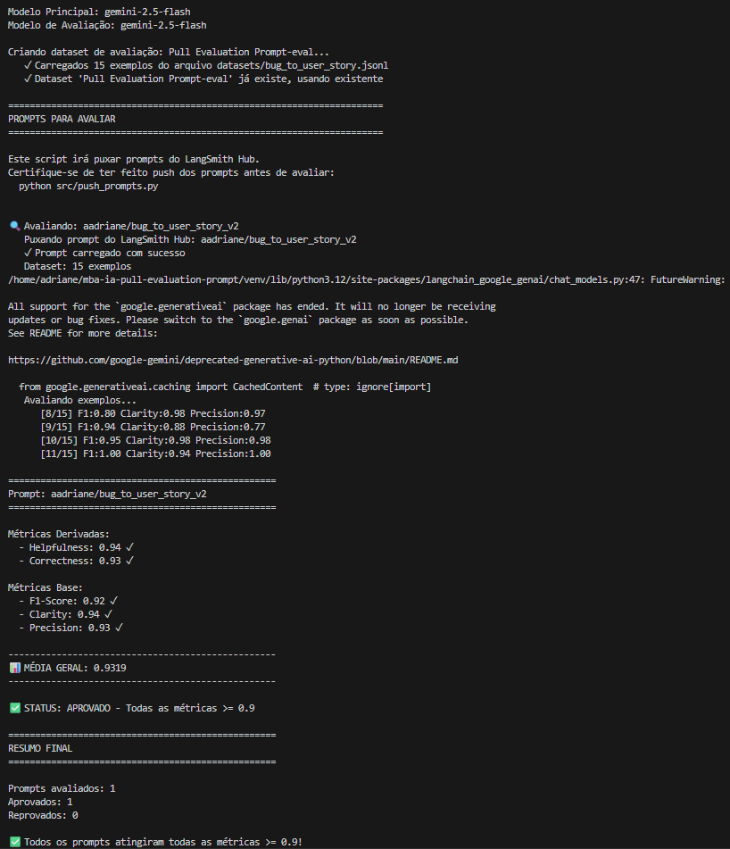
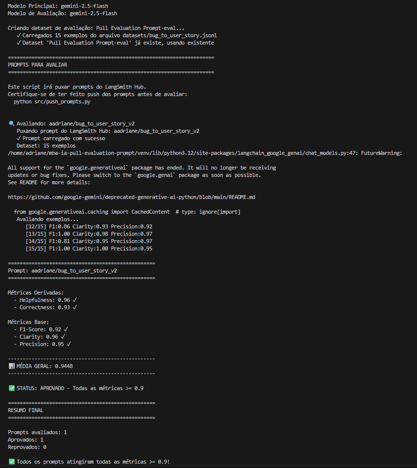

# Pull, Otimização e Avaliação de Prompts com LangChain e LangSmith

## Técnicas utilizadas
- Técnicas escolhidas:
  - Role Prompting
  - Chain of Thought (CoT)
  - Few‑shot Learning

- Justificativa:
  - Role Prompting: define uma persona clara (Product Manager Sênior) para orientar tom, prioridades e foco em valor de negócio — reduz ambiguidades e melhora precisão nas User Stories.
  - Chain of Thought: força decomposição interna do raciocínio (persona → objetivo → valor → complexidade → critérios), aumentando clareza e robustez nas decisões do modelo sobre gravidade e critérios de aceitação.
  - Few‑shot Learning: exemplifica formato e granularidade esperados, garantindo consistência de saída (título, user story, critérios, contexto técnico) e melhor F1/Precision por alinhamento de referências.

- Como foi aplicado (exemplos práticos):
  1. Role Prompting:
     - No system_prompt: "Você é um Product Manager Sênior especializado..." — define responsabilidades, prioridades e restrições (segurança, performance, métricas).
     - Resultado prático: respostas com foco em valor de usuário e critérios testáveis.
  2. Chain of Thought:
     - Implementado como bloco interno "PASSO A PASSO (CoT)" no system_prompt, com passos executados internamente (Persona → Objetivo → Valor → Complexidade → Critérios).
     - Resultado prático: classificação consistente da complexidade (simples/médio/complexo) e critérios de aceitação mais completos.
  3. Few‑shot Learning:
     - Inclusão de 4 exemplos (2 simples, 2 médios, 1 complexo) com bug_report → user story + critérios + contexto técnico, mostrando limites de linhas e estrutura exata.
     - Resultado prático: saída padronizada sem texto adicional, critérios mensuráveis e preservação de valores técnicos do bug.

- Regras e salvaguardas aplicadas:
  - Saída estrita em formatos pré‑definidos (SIMPLES / MÉDIO / COMPLEXO) para evitar derivações.
  - Tratamento de edge cases: inferência documentada com premissas explícitas; SLAs e defaults (ex.: paginação = 20) quando dados faltantes.
  - Regra de não‑repetição entre seções e uso exato de valores numéricos do bug (melhora precisão e rastreabilidade).


## Resultados finais

### Modelo utilizado
Foram utilizados dois modelos diferentes para a resolução do desafio, o claude-sonnet-4.6 (pago) e gemini-2.5-flash (free), ambos como juiz e gerador de resposta. Tabela de comparação de resultados e conclusão do melhor LLM para o problema:

| Aspecto                        | Claude Sonnet 4.6                                 | Gemini 2.5 Flash                                      |
|--------------------------------|---------------------------------------------------|-------------------------------------------------------|
| F1-Score médio                 | 0.75–0.85                                         | 0.91–0.94                                             |
| Clarity médio                  | 0.72–0.82                                         | 0.95–0.98                                             |
| Precision médio                | 0.85–0.92                                         | 0.98–1.00                                             |
| Recall médio                   | 0.62–0.78                                         | 0.90–0.92                                             |
| Principal fraqueza             | Truncamento + omissão de seções                   | Omissões pontuais de detalhes específicos             |
| Verbosidade                    | Excessiva — penaliza clarity                      | Adequada ao formato esperado                          |
| Aderência ao formato           | Parcial — interpreta o template                   | Alta — segue o template literalmente                  |
| Alucinações                    | Raras                                             | Raras                                                 |
| Comportamento sob prompt longo | Degrada — corta seções                            | Estável                                               |
| Inferência de domínio          | Conservadora — omite quando incerto               | Mais agressiva — infere e declara premissa            |

A diferença não está no entendimento do problema, mas em como cada modelo lida com o template. O Gemini trata o formato como contrato rígido a ser preenchido, já o Sonnet trata como referência e adapta, o que gera verbosidade e truncamento nos casos mais densos. Por fim, foi optado pelo modelo FREE gemini-2.5-flash para resolver o desafio.

**Custos com modelo PAGO**

Foram em torno de 10 iterações utilizando o modelo de LLM da anthropic, refatorando e otimizando o prompt, para conseguir estes resultados:



_nota: executado iterações somente até o exemplo número 7_

Custo gerado com testes:



### Execução prompt ruim (v1)
| BUG | F1 SCORE | CLARITY | PRECISION |
|-----|----------|----------|-----------|
| 1   | 0.74     | 0.81     | 0.86      |
| 2   | 0.77     | 0.83     | 0.87      |
| 3   | 0.81     | 0.85     | 0.88      |
| 4   | 0.79     | 0.84     | 0.85      |
| 5   | 0.72     | 0.80     | 0.84      |
| 6   | 0.78     | 0.82     | 0.86      |
| 7   | 0.84     | 0.87     | 0.89      |
| 8   | 0.73     | 0.81     | 0.85      |
| 9   | 0.75     | 0.79     | 0.82      |
| 10  | 0.82     | 0.86     | 0.88      |
| 11  | 0.80     | 0.83     | 0.87      |
| 12  | 0.76     | 0.82     | 0.85      |
| 13  | 0.85     | 0.88     | 0.90      |
| 14  | 0.74     | 0.80     | 0.84      |
| 15  | 0.86     | 0.89     | 0.90      |

| MÉTRICA     | MÉDIA GERAL |
|-------------|-------------|
| F1 SCORE    | 0.7840      |
| CLARITY     | 0.8333      |
| PRECISION   | 0.8640      |
| Helpfulness | 0.8487      |
| Correctness | 0.8240      |
| Média Geral | 0.8308      |

### Execução prompt otimizado (v2)
| BUG | F1 SCORE | CLARITY  | PRECISION |
|-----|----------|----------|-----------|
| 1   | 0.89     | 0.89     | 1.00      |
| 2   | 0.92     | 0.95     | 1.00      |
| 3   | 0.97     | 0.98     | 1.00      |
| 4   | 0.96     | 0.98     | 0.95      |
| 5   | 0.80     | 0.90     | 0.98      |
| 6   | 0.94     | 0.90     | 0.90      |
| 7   | 0.99     | 0.98     | 0.98      |
| 8   | 0.80     | 0.98     | 0.97      |
| 9   | 0.94     | 0.88     | 0.77      |
| 10  | 0.95     | 0.98     | 0.98      |
| 11  | 1.00     | 0.94     | 1.00      |
| 12  | 0.86     | 0.93     | 0.92      |
| 13  | 1.00     | 0.98     | 0.97      |
| 14  | 0.81     | 0.95     | 0.97      |
| 15  | 1.00     | 1.00     | 0.95      |

| MÉTRICA     | MÉDIA GERAL  |
|-------------|--------------|
| F1 SCORE    | 0.9220       |
| CLARITY     | 0.9480       |
| PRECISION   | 0.9560       |
| Helpfulness | 0.9520       |
| Correctness | 0.9390       |
| Média Geral | 0.9434       |

**Screenshots avaliações**

Como mencionado, para a resolução do desafio foi utilizado o modelo FREE gemini-2.5-flash. Por esse motivo, não foi possível realizar a geração de resposta e avaliação dos 15 exemplos em uma única iteração:
 

Avaliações:
 




## Como executar

### Criar e ativar ambiente virtual
`python3 -m venv venv`
`source venv/bin/activate`

### Instalar dependências
`pip install -r requirements.txt`

### Configurar ambiente
`cp .env.example .env`

Defina:
```
LANGSMITH_API_KEY=sua_chave_langsmith
LANGSMITH_USERNAME=seu_username
PROVIDER=openai|gemini|anthropic
OPENAI_API_KEY=sua_chave_openai|null
GOOGLE_API_KEY=sua_chave_google|null
ANTHROPIC_API_KEY=sua_chave_anthropic|null
```

### Executar arquivos

#### 1. Pull do prompt v1
Busca prompt ruim do hub do langSmith e salva em /prompts/bug_to_user_story_v1.yml

`python src/pull_prompts.py`

#### 2. Testar prompt v2
`pytest tests/test_prompts.py`

#### 3. Push do prompt v2
Pulica prompt v2 otimizado no seu projeto langsmith

`python src/push_prompts.py`

#### 4. Executar avaliação
`python src/evaluate.py`


## Evidências no LangSmith

### Dataset de avaliação


### Tracing LangSmith


**Link LangSmith:** [Link projeto LangSmith ](https://smith.langchain.com/o/7f99a733-65d7-4cf9-a43f-aa4c6a6b5afc/dashboards/projects/3085a20b-5e92-4fe0-9fae-ab0b5c5e431a)

**Link LangSmith Hub:** [Prompt otimizado](https://smith.langchain.com/hub/aadriane/bug_to_user_story_v2?organizationId=7f99a733-65d7-4cf9-a43f-aa4c6a6b5afc)
